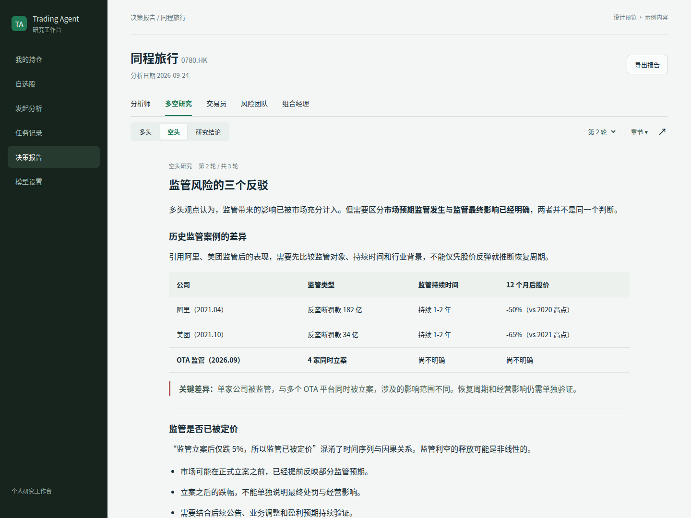
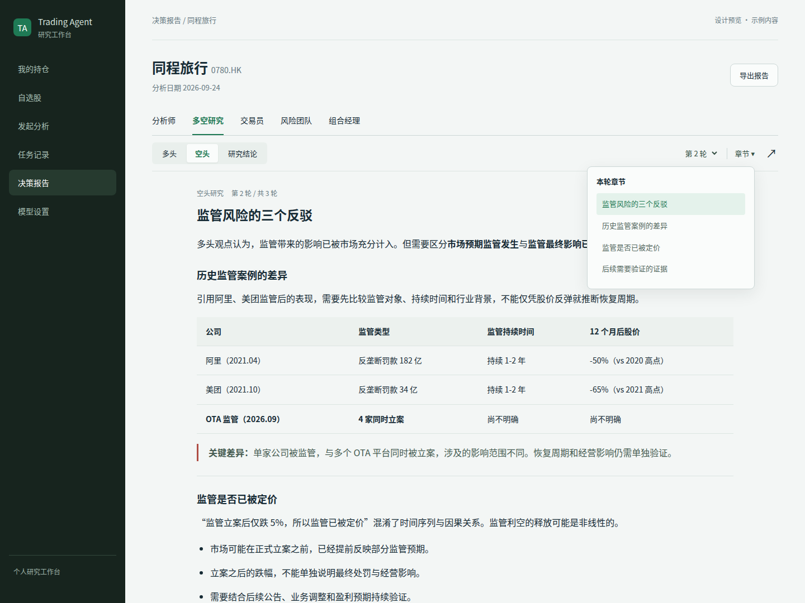
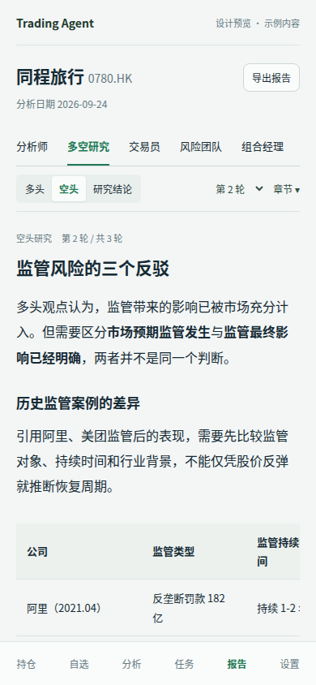
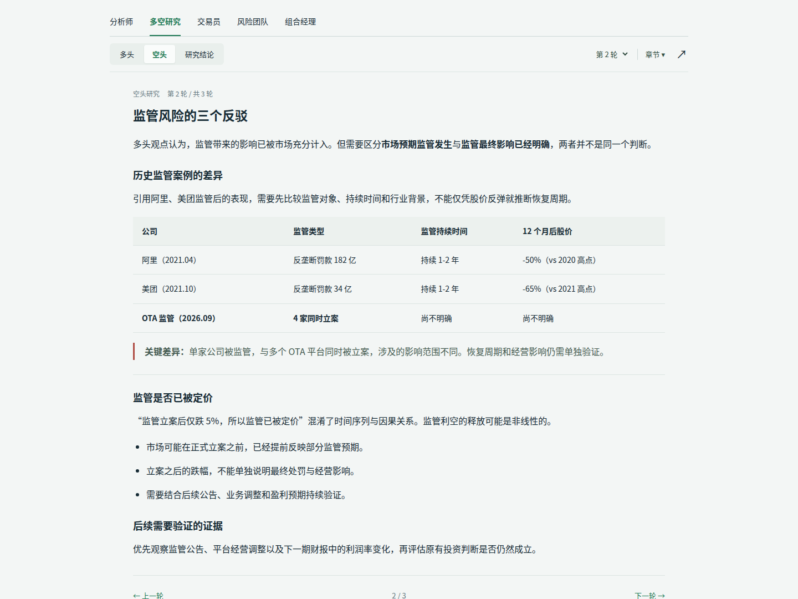
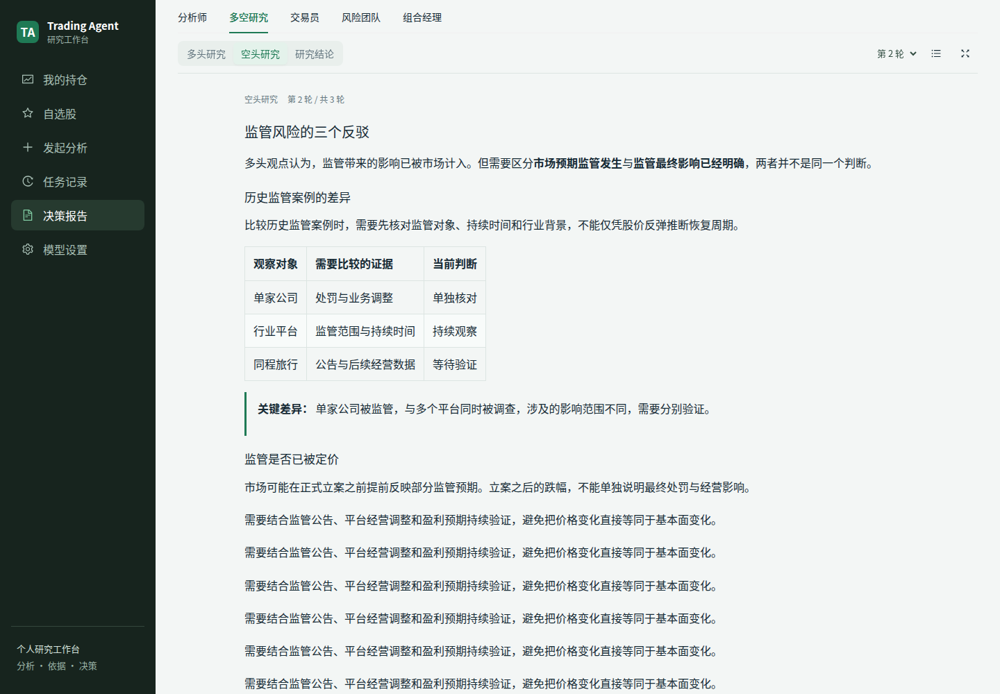
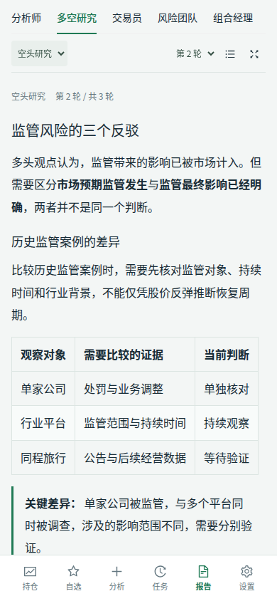
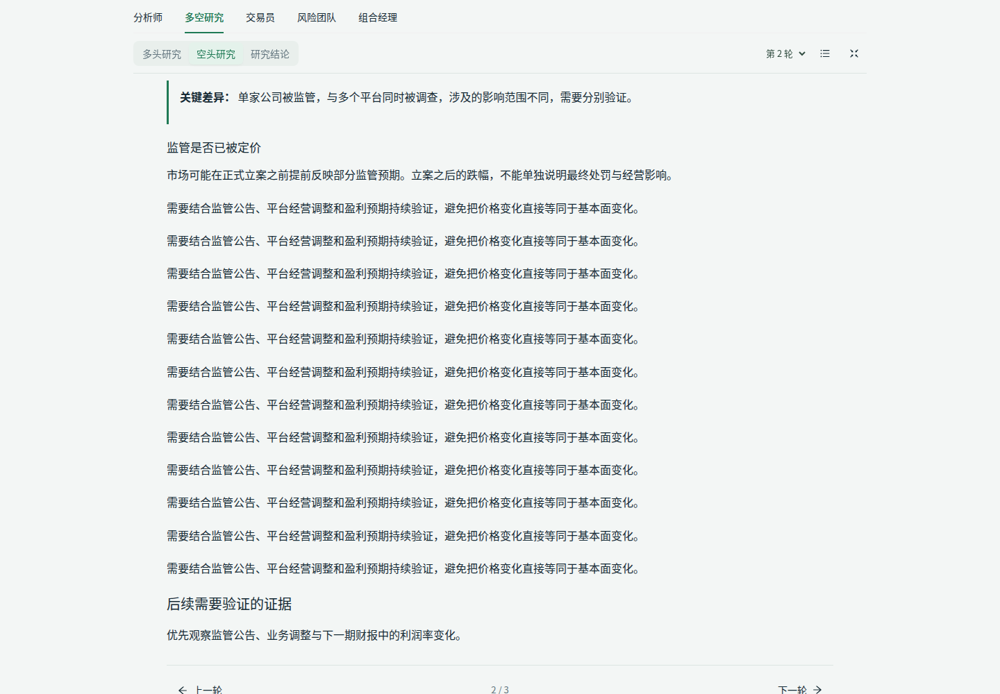

# Report Reading V1: Design Preview

Status: visual design approved in chat and implemented on the feature branch.
The screenshots in Preview Assets remain the original proposal; see Implemented
Reader below for production-component screenshots. No API changes.

## Design Read

A targeted redesign of a financial report reader for repeated research workflows.
Preserve the existing Ant Design foundation, green accent, system sans-serif type,
and compact corner scale. Prioritize reading space over persistent navigation.

The requested `design-taste-frontend` skill informed the preservation audit,
spacing, visual hierarchy, and screenshot checks. Its marketing-specific patterns
are not applicable to this operational interface.

DESIGN_VARIANCE: 3. MOTION_INTENSITY: 1. VISUAL_DENSITY: 5.

## Proposed Presentation

1. Team tabs remain on one horizontal row.
2. The next row combines a role segmented control on the left with a round
   selector and chapter menu on the right. Only the selected role and turn are
   shown. Non-debate reports and research conclusions do not show a round selector.
3. Chapters remain headings in the original report. An on-demand menu navigates
   to those headings and closes after selection. There is no permanent chapter
   sidebar, nested report card, or extra body indentation.

Keep the original text intact. The chapter menu is navigation, not a generated
summary. Recommend continuous reading within a selected turn rather than making
every subsection a separate page or forcing repeated expand actions.

Long reports without usable headings retain continuous reading. Hide chapter and
round controls when no corresponding structure is available; do not invent it.
Native debate histories are accumulated strings with role prefixes, not typed
turn arrays. Robust turn extraction and Markdown parsing are implementation work,
not something this mockup verifies.

## Reading Space

- Desktop: 960px maximum body width in this preview, 16px body type. No new
  permanent sidebar. The two navigation rows use about 108px in total.
- Mobile: 20px horizontal padding and 16px body type. Role, round, and chapter
  controls share a single row in the shown research view. Long tables scroll
  horizontally within the article, not at page level.
- Focus mode: hide the workbench sidebar and page metadata; keep the report
  navigation and body. The same icon exits focus mode.
- During implementation, preserve access to role and turn switching during long
  reads with a compact sticky toolbar. Validate its viewport cost before shipping.
- Mobile roles with longer names, notably the risk team, should use a compact
  native selector rather than compressing type or wrapping into more toolbar rows.

## Preview Assets

All report text and round counts in these images are illustrative sample content,
not verified investment evidence. The preview simplifies the report page header
to concentrate on the reader; it does not propose removing existing decision data.
The isolated visual prototype is not a working production report interface.

### Desktop



### Chapter Menu



### Mobile



### Focus Mode



## Verification

- Captured with headless Chrome through Playwright at 1440x1080 and 390x844.
- Checked page-level horizontal overflow at 390px and 320px: none.
- Visually inspected desktop, mobile, chapter menu, and focus mode screenshots.
- Also inspected a dark-mode prototype; this does not add dark mode to the app.
- No backend/model calls, production changes, or application test claims.

## Approval

The user approved two navigation rows plus an on-demand chapter menu, with
continuous reading within the selected turn, before implementation began.

## Implemented Reader

The implementation retains decision summaries, risk evidence and full Markdown
export. The reader is also shared with live task output. Mobile and narrow panels
use a role selector to keep the toolbar on one line. Focus mode preserves the
visible Markdown block when entering or exiting, isolates the background, and
supports Escape. Team overflow menus and chapter menus stay inside the reader.

Native role markers are extracted outside literal Markdown code/HTML blocks,
including single-newline boundaries following lists, quotes and tables. Legacy
text without a leading marker stays intact. An unindented role prefix inside
generated prose is indistinguishable from a native boundary in the existing
string format; typed turn records would be needed to remove that ambiguity.






Browser acceptance covers 1440px, 1024px, 390px and 320px widths. It intercepts all
API calls and uses illustrative report content, not live investment evidence.

```bash
cd web/client
npm run acceptance:reader
# Optionally use an existing system Chrome:
CHROMIUM_EXECUTABLE_PATH=/usr/bin/google-chrome npm run acceptance:reader
```
